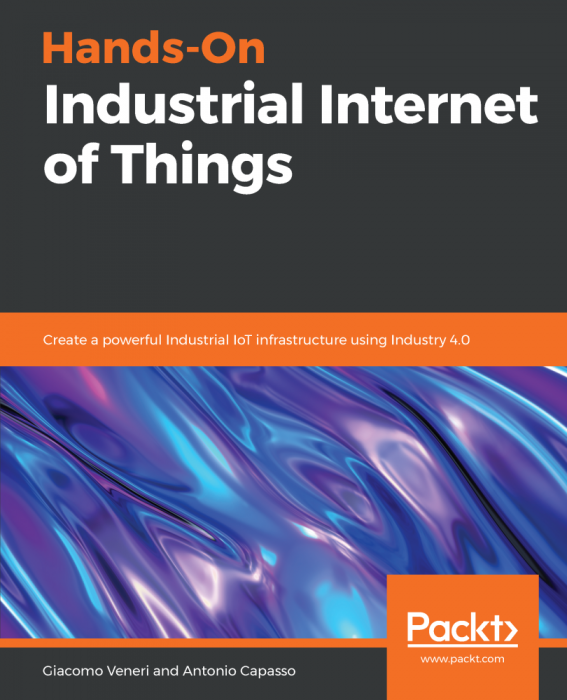

# Hands-On-Industrial-Internet-of-Things

<a href="https://www2.packtpub.com/hardware-and-creative/hands-industrial-internet-things?utm_source=github&utm_medium=repository&utm_campaign=9781789537222"></a>

This is the code repository for [Hands-On Industrial Internet of Things](https://www2.packtpub.com/hardware-and-creative/hands-industrial-internet-things?utm_source=github&utm_medium=repository&utm_campaign=9781789537222), published by Packt.

**Create a powerful Industrial IoT infrastructure using Industry 4.0**

## What is this book about?
This book explains the key feature to develop a complex and stable network that helps to gather the data to optimize the asset performance and maximize the production in the Industries leveraging on the cloud infrastructure and services. By the end, you can design the Industrial IoT network and the architecture for processing its data in the cloud.

This book covers the following exciting features:
* Explore industrial processes, devices, and protocols
* Design and implement the I-IoT network flow
* Gather and transfer industrial data in a secure way
* Get to grips with popular cloud-based platforms
* Understand diagnostic analytics to answer critical workforce questions
* Discover the Edge device and understand Edge and Fog computing
* Implement equipment and process management to achieve business-specific goals

If you feel this book is for you, get your [copy](https://www.amazon.com/dp/1789343046) today!

<a href="https://www.packtpub.com/?utm_source=github&utm_medium=banner&utm_campaign=GitHubBanner"></a>

## Instructions and Navigations
All of the code is organized into folders. For example, Chapter02.

The code will look like the following:
```
mkdir static
echo "<html><body>I-IoT</body></html>" > static/index.html

```

**Following is what you need for this book:**
This book is intended for architects, developers or data scientists working in the industrial sector. This book assumes that the reader has knowledge of Python, JavaScript, NodeJS, and Java, along with a basic knowledge of networking, enterprise architecture, machine learning, and electronic concepts.

With the following software and hardware list you can run all code files present in the book (Chapter 1-15).
### Software and Hardware List
| Chapter | Software required | OS required |
| -------- | ------------------------------------ | ----------------------------------- |
| 1-15 | Docker Community Edition, JDK 1.8, Git, Node.js 8+, Python 3.7, Anaconda 5.3 | Computer with Windows, Linux or macOS |


We also provide a PDF file that has color images of the screenshots/diagrams used in this book. [Click here to download it](https://www.packtpub.com/sites/default/files/downloads/9781789537222_ColorImages.pdf).

### Related products <Paste books from the Other books you may enjoy section>
* Practical Industrial Internet of Things Security [[Packt]](https://india.packtpub.com/in/business/practical-industrial-internet-things-security?utm_source=github&utm_medium=repository&utm_campaign=9781788832687) [[Amazon]](https://www.amazon.com/dp/178883268X)

* Internet of Things for Architects [[Packt]](https://india.packtpub.com/in/hardware-and-creative/internet-things-architects?utm_source=github&utm_medium=repository&utm_campaign=9781788470599) [[Amazon]](https://www.amazon.com/dp/1788470591)
## Get to Know the Authors
**Giacomo Veneri**
graduated in computer science from the University of Siena. He holds a PhD in neuroscience context with various scientific publications. He is Predix Cloud certified and an influencer, as well as SCRUM and Oracle Java certified. He has 18 years' experience as an IT architect and team leader. He has been an expert on IoT in the fields of oil and gas and transportation since 2013. He lives in Tuscany, where he loves cycling.

**Antonio Capasso**
graduated in computer automation in 1999 and computer science in 2003 from the University of Naples. He has been working for twenty years on large and complex IT projects related to the industrial world in a variety of fields (automotive, pharma, food and beverage, and oil and gas), in a variety of roles (programmer, analyst, architect, and team leader) with different technologies and software. Since 2011, he has been involved in building and securing industrial IoT infrastructure. He currently lives in Tuscany, where he loves trekking and swimming.
 

### Suggestions and Feedback
[Click here](https://docs.google.com/forms/d/e/1FAIpQLSdy7dATC6QmEL81FIUuymZ0Wy9vH1jHkvpY57OiMeKGqib_Ow/viewform) if you have any feedback or suggestions.
